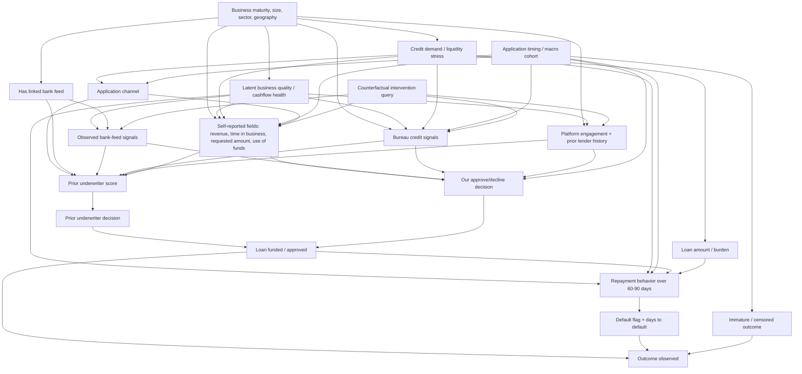

# Hackathon DAG and Dataset “Tricks” Analysis

Source repo: `intuit/intuit-techweek-nyc-hackathon-2026`

## Executive summary

This is not a clean causal inference dataset. It is a predictive underwriting challenge with a causal-counterfactual deliverable layered on top.

The core task is to use historical small-business loan applications to:

1. Decide whom to fund.
2. Predict probability of default.
3. Forecast default timing by cohort.
4. Answer causal what-if intervention queries.
5. Defend the methodology in a short technical writeup.

The biggest hidden challenge is that repayment outcomes are not observed for everyone. In the training data, outcomes are only filled in for loans the prior lender approved and that have matured. That creates selection bias and censoring. A naive supervised model will learn default risk conditional on the prior lender’s approval policy, not default risk for all applicants if funded.

---

## Practical DAG



---

## Key traps and dataset design tricks

### 1. Outcome labels are selected, not missing at random

In `train.csv`, repayment outcomes are filled only for loans the prior lender approved and that have matured. Declined or immature loans have blank outcome fields.

That means a naive model trained only on rows with `default_flag` estimates:

```text
P(default | prior approved, matured, observed features)
```

not:

```text
P(default | funded by our policy, observed features)
```

This is a collider/selection issue:

```text
Applicant risk factors → prior_underwriter_score → prior_decision → outcome observed
Applicant risk factors → default risk
Maturity / time → outcome observed
```

Conditioning on rows with observed outcomes opens bias through `prior_decision` and `observation_status`.

**Recommended response:**

- Train the base PD model on approved+matured loans.
- Calibrate aggressively on validation.
- Stratify calibration by prior decision / prior score bands if available.
- Use conservative uncertainty intervals for applicants far from the prior-approved training distribution.
- In the writeup, explicitly name the selection problem.

---

### 2. `prior_underwriter_score` is powerful but dangerous

The prior underwriter score likely compresses many risk features and may be highly predictive.

But it is also a policy artifact. Overusing it can cause the new model to inherit the old lender’s selection bias and blind spots.

**Recommended response:**

Use `prior_underwriter_score` as a predictive feature, but do not treat it as causal. In the writeup, say that it is a proxy for prior policy and risk, not an intervention target or causal driver.

Suggested writeup language:

> We used prior-underwriter variables as predictive summaries, but not as causal variables. Because outcomes are observed conditional on prior approval and maturity, we audited calibration by prior-decision strata and treated the prior score as a policy-contaminated proxy.

---

### 3. `prior_decision` is almost a label-observation switch

Because outcomes are observed only for approved applications, `prior_decision` partially determines whether a training label exists.

This means it is not just another categorical feature. It sits directly on the path into label observability.

**Risk:**

A model trained only on observed outcome rows may silently learn the prior lender’s approval frontier instead of the true default frontier.

**Recommended response:**

- Include prior decision cautiously.
- Test model performance with and without it.
- Use it for selection-bias diagnostics.
- Avoid presenting it as causal.

---

### 4. Bank-feed missingness is informative

Bank-feed columns are null when `has_linked_bank_feed = False`. This is not random missingness.

Possible causal structure:

```text
Latent applicant sophistication / urgency / trust → has_linked_bank_feed
Latent business quality → has_linked_bank_feed
has_linked_bank_feed → bank-feed fields observed
Latent business quality → default
```

So `has_linked_bank_feed` and bank-feed missingness are themselves signals.

**Recommended response:**

- Use CatBoost or LightGBM, which handle missingness well.
- Add missingness flags for bank-feed variables.
- Keep `has_linked_bank_feed` as a separate feature.
- Do not mean-impute bank-feed variables without preserving missingness.

---

### 5. Counterfactual intervention queries are not all equally “do-able”

Deliverable C asks for predictions under `do(feature = value)`. But intervention queries may include historical or contextual fields, not only clean levers.

Examples include:

- `stated_annual_revenue`
- `invoice_payment_delinquency_rate`
- `aggregate_credit_utilization`
- `application_channel`
- `prior_loans_count`
- `account_age_days`

Some of these are plausibly intervenable; others are historical summaries or proxies.

**Recommended response:**

Use a structured counterfactual policy:

```text
If the feature is plausibly intervenable:
  replace the feature value and predict with the counterfactual model.

If the feature is historical/proxy/contextual:
  treat the counterfactual effect conservatively and shrink toward the original PD.

If the feature changes an engineered dependent variable:
  update the dependent ratio when logically required.
```

**Important:** Do not blindly treat every column intervention as equally causal.

---

### 6. Duplicate or near-duplicate intervention queries may exist

The intervention query sample includes repeated applicant-feature-value combinations. That means deterministic generation matters.

**Recommended response:**

- Cache counterfactual predictions by `(applicant_id, feature_name, intervention_value)`.
- Ensure identical queries return identical predictions.
- This prevents unnecessary inconsistency in automated scoring.

---

### 7. `requested_amount_to_observed_revenue` is useful but fragile

This engineered ratio likely captures debt burden relative to bank-observed revenue. It should be predictive.

But it depends on observed bank-feed revenue, so it may be null or unstable when no feed is linked.

**Recommended response:**

- Use both raw fields and the ratio.
- Winsorize or clip extreme ratios.
- Add missingness indicators.
- For counterfactuals involving `requested_amount` or observed revenue, update the ratio consistently if the model uses it.

---

### 8. Default timing is not the same as default classification

Default is triggered by any of the following:

1. Three consecutive missed daily draws.
2. Six total missed daily draws.
3. Positive outstanding balance at day 90.

Deliverable B asks for cumulative default rates by cohort and loan age. This is a survival/timing problem, not merely a binary classification problem.

**Recommended response:**

- Estimate final PD for each approved applicant.
- Estimate a default-time distribution using observed `days_to_default`.
- Convert final PD into a cumulative default curve.
- Enforce monotonicity by cohort and age.
- Calibrate the final cumulative default rate to match portfolio-level expected defaults.

Simple approach:

```text
For each approved applicant:
  final_pd = model prediction
  timing_curve(age) = empirical/hazard-based P(default by age | default)
  applicant_cdr(age) = final_pd * timing_curve(age)

For each cohort:
  cohort_cdr(age) = mean applicant_cdr(age) among approved loans in cohort
```

---

### 9. Validation is unusually valuable but creates overfitting risk

Validation has outcomes filled in and is included in the required Deliverable A rows. This makes it useful for calibration but risky for overfitting.

**Recommended response:**

- Use validation to calibrate PD and uncertainty intervals.
- Avoid hard-coding validation outcomes directly into decisions if the scoring/review penalizes obvious leakage.
- Use validation to check calibration across segments: prior score bands, bank-feed linked vs not linked, requested amount bands, cohort weeks, and credit bands.

---

## DAG-level confounder map

| Relationship | Main confounders to control for |
|---|---|
| Bank-feed signals → default | Business maturity, sector, applicant sophistication, `has_linked_bank_feed`, platform engagement |
| Requested amount → default | Revenue, credit utilization, debt obligations, cash balance, use of funds, latent liquidity stress |
| Application channel → default | Applicant segment, urgency, cohort timing, platform engagement |
| Credit utilization → default | Revenue, debt obligations, sector, owner credit band, prior declines |
| Platform activity → default | Business maturity, prior successful borrowing, account age, selection into platform |
| Prior loan count → default | Survivor bias, prior approval, prior repayment history, business age |
| Prior underwriter score → default | Nearly all upstream applicant risk features plus prior policy selection |

---

## Modeling implications

### Base PD model

Recommended models:

- CatBoost
- LightGBM
- XGBoost
- Logistic regression as a calibrated baseline

Use categorical handling, missingness handling, and monotonic sanity checks.

### Calibration

Use:

- Isotonic regression
- Platt scaling / logistic calibration
- Segment-level calibration diagnostics
- Bootstrap or conformal-style intervals for 90% bounds

### Selection correction

At minimum:

- Flag training rows with observed outcomes.
- Model `P(outcome observed | X)` or `P(prior approved and matured | X)`.
- Use this as a diagnostic or inverse-propensity weight.
- Report limitations clearly.

### Counterfactual model

For Deliverable C:

1. Start with the calibrated PD model.
2. Apply `do(feature = value)` to the queried applicant.
3. Update dependent engineered fields when logically required.
4. For non-intervenable or historical features, shrink the predicted delta toward zero.
5. Return uncertainty intervals wider than ordinary predictive intervals for ambiguous interventions.

---

## Writeup framing

Suggested language for Section 1:

> The central assumption violation is selective label observation. Historical repayment outcomes are observed only for loans that the prior underwriting system approved and that have matured. Therefore, naive supervised learning estimates default risk conditional on prior approval and maturity, not default risk for every applicant under our funding policy. We model this as a selection/censoring problem and treat prior-underwriter fields as policy-contaminated proxies rather than causal drivers.

Suggested language for Section 3:

> Our DAG separates latent business health, credit demand, application context, observed underwriting features, prior lender policy, funding, and repayment outcomes. For counterfactual queries, we distinguish manipulable features from historical or proxy variables. When a queried feature is plausibly intervenable, we apply the intervention directly and update dependent engineered quantities. When the feature is historical or policy-derived, we shrink the causal effect toward the baseline prediction and widen uncertainty intervals.

---

## Priority action list

1. Build a strong calibrated PD model.
2. Audit the label-selection mechanism.
3. Use prior-underwriter variables cautiously.
4. Preserve bank-feed missingness as signal.
5. Build default-timing curves using survival/hazard logic.
6. Make counterfactual outputs deterministic.
7. Treat non-intervenable intervention queries conservatively.
8. Explain all of the above in the writeup.

---

## Bottom line

The likely hidden tricks are:

1. Selected labels: outcomes only for prior-approved and matured loans.
2. Censoring: immature/open loans are not true negatives.
3. Prior-underwriter variables: predictive but policy-contaminated.
4. Bank-feed missingness: missingness is informative.
5. Intervention mismatch: some queried features are not truly manipulable.
6. Duplicate causal queries: deterministic outputs are required.
7. Timing task: default trajectory needs survival/hazard thinking.
8. Validation leakage risk: validation has outcomes and is included in submission rows.

The winning team will not just run XGBoost. They will show they understand the data-generating process, selection bias, calibration, causal-vs-predictive distinctions, and default timing.
